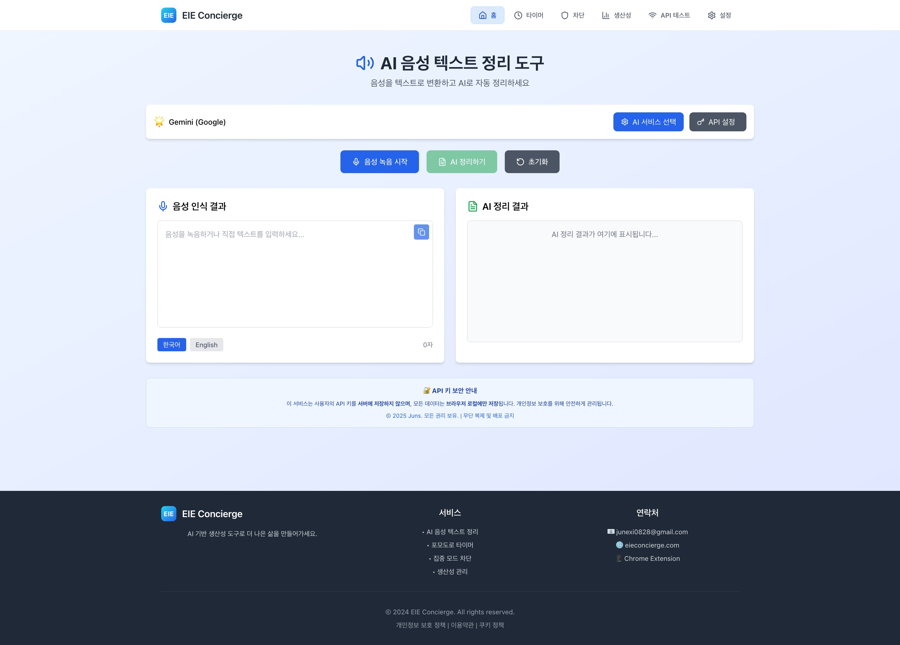
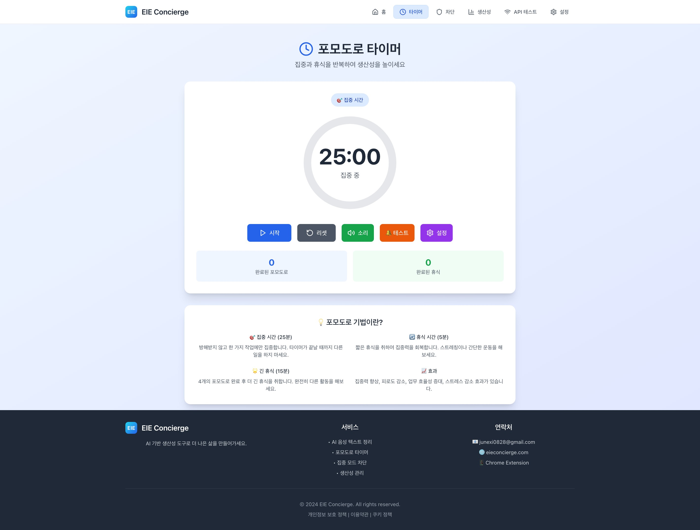
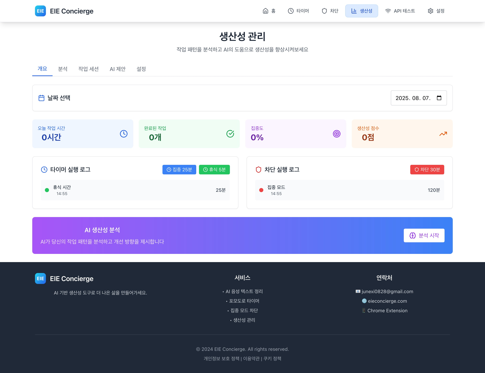

# EIE Concierge - AI-Powered Productivity Platform

<div align="center">


[](https://vercel.com)
[](https://chrome.google.com/webstore)

**AI 기반 생산성 도구로 더 나은 삶을 만들어가세요**

**🌐 [https://eieconcierge.com/](https://eieconcierge.com/)**

</div>

<div align="center">






</div>

---

## 📋 Table of Contents

- [Overview](#-overview)
- [Architecture](#-architecture)
- [Features](#-features)
- [Technology Stack](#-technology-stack)
- [Getting Started](#-getting-started)
- [API Documentation](#-api-documentation)
- [Deployment](#-deployment)
- [Contributing](#-contributing)
- [License](#-license)

---

## 🎯 Overview

**EIE Concierge**는 AI 기술을 활용한 종합 생산성 관리 플랫폼입니다. 음성 인식, 포모도로 타이머, 집중 모드 차단, 생산성 분석 등 다양한 기능을 통합하여 사용자의 업무 효율성을 극대화합니다.

### 🏆 Key Highlights

- **🔊 AI Voice Recognition**: 실시간 음성-텍스트 변환 및 AI 요약
- **⏱️ Smart Timer System**: 포모도로 기반 집중력 향상 도구
- **🛡️ Focus Mode**: 방해 요소 차단으로 깊은 집중 환경 제공
- **📊 Productivity Analytics**: AI 기반 생산성 분석 및 개선 제안
- **🔄 Real-time Sync**: 서버-클라이언트 실시간 데이터 동기화

---

## 🏗️ Architecture

### System Architecture

```
┌─────────────────┐    ┌─────────────────┐    ┌─────────────────┐
│   Frontend      │    │   Backend       │    │   AI Services   │
│   (React)       │◄──►│   (Node.js)     │◄──►│   (Claude/GPT)  │
└─────────────────┘    └─────────────────┘    └─────────────────┘
         │                       │                       │
         ▼                       ▼                       ▼
┌─────────────────┐    ┌─────────────────┐    ┌─────────────────┐
│  Context API    │    │  REST API       │    │  External APIs  │
│  (State Mgmt)   │    │  (Express)      │    │  (AI Providers) │
└─────────────────┘    └─────────────────┘    └─────────────────┘
```

### Component Architecture

```
ProductivityProvider (Context)
├── PomodoroTimer
│   └── addTimerLog() → Backend API
├── BlockPage
│   └── addBlockLog() → Backend API
├── ProductivityManager
│   ├── Data Visualization
│   ├── AI Analysis
│   └── Real-time Updates
└── VoiceTextSummarizer
    └── AI Processing
```

---

## ✨ Features

### 🎤 AI Voice Processing

- **Real-time Speech Recognition**: Web Speech API 기반 실시간 음성 인식
- **Multi-AI Summarization**: Claude, GPT, Groq, Perplexity, Gemini 지원
- **Smart Text Processing**: 자동 가변 입력창 및 마크다운 지원
- **Secure API Management**: 브라우저 로컬 기반 API 키 관리

### ⏰ Productivity Timer

- **Pomodoro Technique**: 25분 집중 / 5분 휴식 사이클
- **Customizable Settings**: 작업/휴식 시간 및 알림음 설정
- **Progress Tracking**: 실시간 진행률 및 통계 표시
- **Auto-logging**: 타이머 완료 시 자동 생산성 데이터 기록

### 🛡️ Focus Mode System

- **Website Blocking**: 소셜미디어, 엔터테인먼트 사이트 차단
- **Schedule Management**: 시간대별 자동 차단 스케줄링
- **Algorithm Challenges**: 차단 해제를 위한 알고리즘 문제 풀이
- **Browser Integration**: Chrome 확장 프로그램 연동

### 📈 Productivity Analytics

- **Real-time Dashboard**: 일일/주간/월간 생산성 통계
- **AI-powered Insights**: 작업 패턴 분석 및 개선 제안
- **Data Visualization**: 차트 및 그래프 기반 시각화
- **Goal Tracking**: 생산성 목표 설정 및 달성률 추적

### 🔄 Data Synchronization

- **Offline Support**: 로컬 스토리지 기반 오프라인 동작
- **Auto Sync**: 온라인 시 자동 서버 동기화
- **Conflict Resolution**: 데이터 충돌 자동 해결
- **Backup & Restore**: 데이터 백업 및 복원 기능

---

## 🛠️ Technology Stack

### Frontend

- **Framework**: React 18.2.0 with Hooks
- **State Management**: Context API + useReducer
- **Styling**: Tailwind CSS 3.4.17
- **UI Components**: Lucide React Icons
- **Build Tool**: Create React App 5.0.1

### Backend

- **Runtime**: Node.js 18+
- **Framework**: Express.js 4.18.2
- **CORS**: Cross-Origin Resource Sharing
- **File System**: Node.js fs module
- **Process Management**: Child Process API

### AI & External Services

- **Claude**: Anthropic AI API
- **GPT**: OpenAI API
- **Groq**: High-speed AI API
- **Perplexity**: Search-based AI
- **Gemini**: Google AI API

### Data Storage

- **Client-side**: localStorage, Chrome Storage API
- **Server-side**: File-based JSON storage
- **Sync**: RESTful API endpoints

### Development Tools

- **Package Manager**: npm 9+
- **Version Control**: Git
- **Deployment**: Vercel, Chrome Web Store
- **Code Quality**: ESLint, Prettier

---

## 🚀 Getting Started

### Prerequisites

- Node.js 18.0.0 or higher
- npm 9.0.0 or higher
- Chrome browser (for extension)
- Git

### Installation

```bash
# Clone the repository
git clone https://github.com/junexi0828/voice-summarizer.git
cd voice-summarizer

# Install dependencies
npm install

# Start development server
npm start
```

### Environment Setup

```bash
# Create environment file
cp .env.example .env

# Configure environment variables
REACT_APP_API_URL=http://localhost:3001
```

### Backend Server

```bash
# Start backend server
npm run server

# Server will run on http://localhost:3001
```

---

## 📚 API Documentation

### Core Endpoints

#### Productivity Management

```http
GET    /api/timer-logs          # Get timer logs
POST   /api/timer-logs          # Add timer log
GET    /api/block-logs          # Get block logs
POST   /api/block-logs          # Add block log
POST   /api/sync-logs           # Sync local logs
```

#### Focus Mode

```http
GET    /api/block/status        # Get blocking status
POST   /api/block/start         # Start blocking
POST   /api/block/stop          # Stop blocking
GET    /api/block/sites         # Get blocked sites
```

#### System Management

```http
GET    /api/status              # System status
GET    /api/settings            # User settings
POST   /api/settings/reset      # Reset settings
```

### Response Format

```json
{
  "success": true,
  "data": {},
  "message": "Operation completed successfully",
  "timestamp": "2025-08-07T08:00:00.000Z"
}
```

---

## 🚀 Deployment

### Web Application (Vercel)

```bash
# Build for production
npm run build

# Deploy to Vercel
vercel --prod
```

### Chrome Extension

```bash
# Build extension
npm run build:extension

# Load in Chrome
# 1. Open chrome://extensions/
# 2. Enable Developer mode
# 3. Load unpacked extension
# 4. Select build folder
```

### Backend Server

```bash
# Production build
npm run build:server

# Start production server
npm run start:prod
```

---

## 🤝 Contributing

We welcome contributions! Please see our [Contributing Guidelines](CONTRIBUTING.md) for details.

### Development Workflow

1. **Fork** the repository
2. **Create** a feature branch (`git checkout -b feature/AmazingFeature`)
3. **Commit** your changes (`git commit -m 'Add AmazingFeature'`)
4. **Push** to the branch (`git push origin feature/AmazingFeature`)
5. **Open** a Pull Request

### Code Standards

- Follow ESLint configuration
- Use TypeScript for new features
- Write comprehensive tests
- Update documentation

---

## 📄 License

This project is licensed under the MIT License - see the [LICENSE](LICENSE) file for details.

---

## 📞 Contact & Support

<div align="center">

**EIE Concierge Team**

[](mailto:junexi0828@gmail.com)
[](https://github.com/junexi0828)
[](https://velog.io/@junexi0828/)
[](https://eieconcierge.com/)

</div>

---

<div align="center">

**Made with ❤️ by Juns**


> © 2025 EIE Concierge. All rights reserved. | Privacy Policy | Terms of Service

</div>
